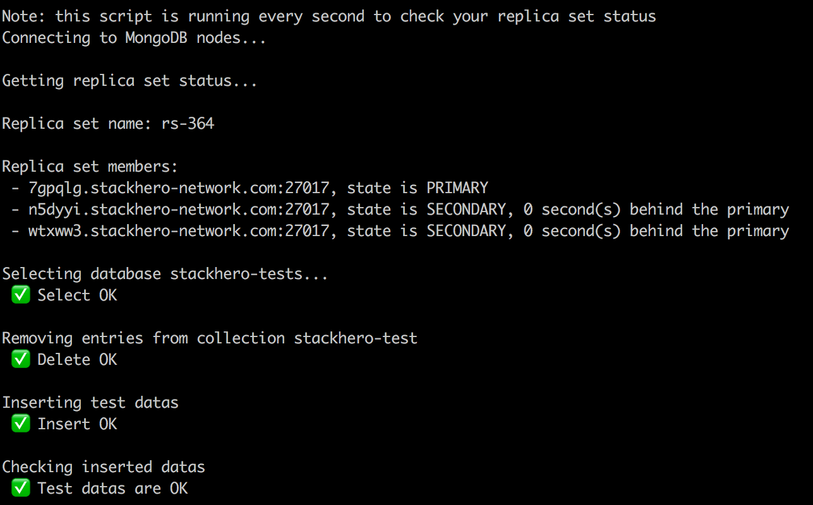

# MongoDB Replica Set

In this example, you'll retrieve your MongoDB replica set status.



You'll get more informations about replica set on [Stackhero's website](https://www.stackhero.io/).


## Clone the repository

```
git clone https://github.com/stackhero-io/documentations.git
cd documentations/content/mongodb/codeExamples/replicaSet/
```

## Start the script

First, you have to fill the `.env-example` file and rename it to `.env`.

Note that `MONGODB_NODES` is your nodes domains, separate by a comma.


Then you can run the script with `npm run start`.

You'll get you replica set status in live, refreshed every second.